Chainbridge solution
====================

For the time being, a reasonably sufficent design choice for the bridge would be the
Mailbox-Monitor approach (see *background.md* for more details), with contracts on both
chains implementing lock&mint/burn&release operations in both direction. The "mailbox"
account on each chain would also be the corresponding contract's account.

The ETH-to-Welups flow would be like this:
  * User A chooses to transfer x ETHs to Welups chain, as x W_ETHs minted tokens representing x ETHs.
  * A `send()` transaction to transfer x ETH from the user's wallet to the contract ("mailbox") account is initiated on Ethereum.
  * The contract upon receiving x ETHs locks them and emits `Deposited` event
  * The monitor upon hearing `Deposited` calls the contract on Welups to mint x W_ETHs tokens
    - If succeeded, transfers those to user A's balance, goto next step.
    - If failed, emits `MintFailure` event, the monitor then calls the contract on
         Ethereum to release A's x ETHs and sends them back
         to A, notifies A of the failure, end.
  * A then uses y W_ETHs to make transactions on Welups, x - y = z W_ETHs remaining in
  * A's possession
  * A redeems z W_ETHs, the contract on Welups is called to burn z W_ETHs, then emits
  * `Withdrawal` event
  * Upon hearing `Withdrawal` event, the monitor calls the contract on Ethereum end to release z
     ETHs and sends them back to A's wallet
     - If succeeded, end
     - If failed, locks z ETHs again, emits `ReleaseFailure` event, the monitor then calls
          the contract on Welups to mint z W_ETHs and transfers back to A's Welups wallet,
          notifies A of the failure, end.
  
The other Welups-to-Eth direction should be the more or less the same.

### ETH-to-Welups deposit flow

### Welups-to-ETH release flow

Key management solution proposal
================================

To quote the relevant section, for more details check out *background.md*:

>A less contrived and probably the usual approach is to store the master key in a medium
>trusted to be secure, managed by a trusted party, and that trusted party supplies it to
>the process doing the transaction signing at startup so it could decrypt the users'
>private keys.
