Chainbridge solution
====================

For the time being, a reasonably sufficent design choice for the bridge would be the
Mailbox-Monitor approach (see *background.md* for more details), with contracts on both
chains implementing lock&mint/burn&release operations in both direction. The "mailbox"
account on each chain would also be the corresponding contract's account.

The ETH-to-Welups flow would be like this:
#### Deposit flow
* (1) deposit x ETH to Welups
* (2) process deposit request 
  * (2.1) deposit x ETH 
    * (2.1.1) charge x Eth
    * (2.1.2) lock x Eth
    * (2.1.3) Deposited event
* (3) request to mint x W_ETH tokens
  * (3.1) retrieve User's private key to sign transaction
  * (3.2) mint x W_ETH tokens
    * (3.2.1) issue x W_ETH tokens for user
    * (3.2.2) Minted event
* (4) Transfer succeeded
  
#### Withdraw flow
* (1) redeem z W_ETH from Welups to Ethereum
* (2) process redeem request
  * (2.1) retrieve User's private key
  * (2.2) burn z W_ETH
    * (2.2.1) burn z W_ETH
    * (2.2.2) Burned event
* (3) request to release z ETH to User's Ethereum account
  * (3.1) Unlock and transfer z ETH to User's account
  * (3.1) z ETH
  * (3.2) Withdraw event
* (4) Transfer succeeded

The other Welups-to-Eth direction should be the same.

Below are the charts illustrating this flow:

### ETH-to-Welups deposit flow

### Welups-to-ETH release flow

### User interface
A rudimentary UI/UX wireframe can be found [here](https://ninjamock.com/s/S63LNJx)

Key management solution proposal
================================

To quote the relevant section, for more details check out *background.md*:

>A less contrived and probably the usual approach is to store the master key in a medium
>trusted to be secure, managed by a trusted party, and that trusted party supplies it to
>the process doing the transaction signing at startup so it could decrypt the users'
>private keys.
